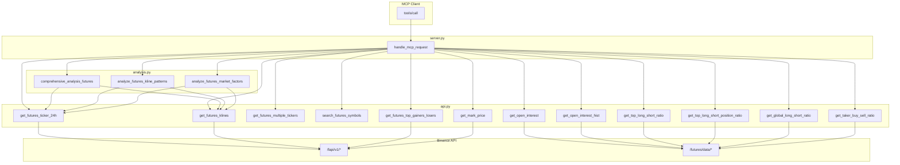

# 合约完整功能实现计划

## 一、涉及文件


| 文件                                                 | 修改内容                                             |
| -------------------------------------------------- | ------------------------------------------------ |
| [binance_mcp/config.py](binance_mcp/config.py)     | 新增 `FUTURES_DATA_BASE_URLS`                      |
| [binance_mcp/api.py](binance_mcp/api.py)           | 新增 `make_futures_data_request`、7 个新函数、2 个批量/搜索函数 |
| [binance_mcp/analysis.py](binance_mcp/analysis.py) | 新增 3 个合约版技术分析函数                                  |
| [binance_mcp/server.py](binance_mcp/server.py)     | 新增 15 个 MCP 工具定义及路由                              |
| [binance_mcp/**init**.py](binance_mcp/__init__.py) | 导出新函数                                            |


---

## 二、配置层：Futures Data 接口

`/futures/data/*` 使用独立 base URL，与 `/fapi/v1` 不同。

**config.py** 新增：

```python
FUTURES_DATA_BASE_URLS = [
    "https://fapi.binance.com/futures/data",
    "https://fapi1.binance.com/futures/data",
]
```

---

## 三、API 层：新增请求函数与业务函数

### 3.1 新增 `make_futures_data_request`

在 [api.py](binance_mcp/api.py) 中新增，用于调用 `FUTURES_DATA_BASE_URLS` 下的接口，逻辑参考 `make_futures_request`（重试、错误处理等）。

### 3.2 暴露已有函数为 MCP（无需改 api.py）

- `get_futures_ticker_24h`：已存在，仅需在 server 中注册
- `get_futures_klines`：已存在，仅需在 server 中注册

### 3.3 新增 API 函数


| 函数                                  | 实现方式                                                                             | 说明                          |
| ----------------------------------- | -------------------------------------------------------------------------------- | --------------------------- |
| `get_futures_multiple_tickers`      | 循环调用 `get_futures_ticker_24h`                                                    | 参考 `get_multiple_tickers`   |
| `search_futures_symbols`            | `make_futures_request("/exchangeInfo", {})` 过滤 USDT 交易对                          | 参考 `search_symbols`         |
| `get_futures_top_gainers_losers`    | `make_futures_request("/ticker/24hr", {})` 后按涨跌幅排序                               | 参考 `get_top_gainers_losers` |
| `get_open_interest`                 | `make_futures_data_request("openInterest", {symbol})`                            | 当前持仓量                       |
| `get_open_interest_hist`            | `make_futures_data_request("openInterestHist", {symbol, period, limit})`         | 持仓量历史                       |
| `get_top_long_short_ratio`          | `make_futures_data_request("topLongShortAccountRatio", {symbol, period, limit})` | 大户账户多空比                     |
| `get_top_long_short_position_ratio` | `make_futures_data_request("topLongShortPositionRatio", ...)`                    | 大户持仓多空比                     |
| `get_global_long_short_ratio`       | `make_futures_data_request("globalLongShortAccountRatio", ...)`                  | 全市场多空比                      |
| `get_taker_buy_sell_ratio`          | `make_futures_data_request("takerlongshortRatio", ...)`                          | 主动买卖比                       |
| `get_mark_price`                    | `make_futures_request("/premiumIndex", {symbol})` 封装返回                           | 标记价、资金费率、下次结算时间             |


**币安 `/futures/data` 参数约定**：

- `period`: 5m, 15m, 30m, 1h, 2h, 4h, 6h, 12h, 1d
- `limit`: 默认 30，最大 500

---

## 四、分析层：合约版技术分析

在 [analysis.py](binance_mcp/analysis.py) 中新增 3 个函数，复用 `indicators` 中的 RSI/MACD/布林带等，仅将数据源改为合约接口。


| 函数                               | 数据源                                             | 实现方式                                 |
| -------------------------------- | ----------------------------------------------- | ------------------------------------ |
| `comprehensive_analysis_futures` | `get_futures_klines` + `get_futures_ticker_24h` | 复制 `comprehensive_analysis` 逻辑，替换数据源 |
| `analyze_futures_kline_patterns` | `get_futures_klines`                            | 复制 `analyze_kline_patterns` 逻辑，替换数据源 |
| `analyze_futures_market_factors` | `get_futures_ticker_24h`                        | 复制 `analyze_market_factors` 逻辑，替换数据源 |


需在 analysis.py 中新增：`from .api import ..., get_futures_ticker_24h, get_futures_klines`，并在上述 3 个函数内调用合约接口。

---

## 五、MCP 工具定义与路由

### 5.1 新增 MCP 工具（插入到“合约分析”区块）

在 [server.py](binance_mcp/server.py) 的 `MCP_TOOLS` 中，在 `analyze_spot_vs_futures` 之后添加：

1. **get_futures_ticker_24h** - symbol(required)
2. **get_futures_klines** - symbol(required), interval(default 1h), limit(default 100)
3. **get_futures_multiple_tickers** - symbols(required, array)
4. **search_futures_symbols** - keyword(required)
5. **get_futures_top_gainers_losers** - limit(default 10)
6. **get_open_interest** - symbol(required)
7. **get_open_interest_hist** - symbol(required), period(default 1h), limit(default 30)
8. **get_top_long_short_ratio** - symbol(required), period(default 1h), limit(default 30)
9. **get_top_long_short_position_ratio** - symbol(required), period(default 1h), limit(default 30)
10. **get_global_long_short_ratio** - symbol(required), period(default 1h), limit(default 30)
11. **get_taker_buy_sell_ratio** - symbol(required), period(default 1h), limit(default 30)
12. **get_mark_price** - symbol(required)
13. **comprehensive_analysis_futures** - symbol(required)
14. **analyze_futures_kline_patterns** - symbol(required), interval(default 4h)
15. **analyze_futures_market_factors** - symbol(required)

### 5.2 handle_mcp_request 路由

在 `tools/call` 的 `elif` 链中，对应上述 15 个工具增加分支，调用相应函数并传入 `arguments` 中的参数。

---

## 六、数据流示意




---

## 七、实施顺序建议

1. config.py：添加 `FUTURES_DATA_BASE_URLS`
2. api.py：`make_futures_data_request` → 7 个合约专属函数 → `get_futures_multiple_tickers`、`search_futures_symbols`、`get_futures_top_gainers_losers`、`get_mark_price`
3. analysis.py：3 个合约版技术分析函数
4. server.py：15 个 MCP 工具定义与路由
5. **init**.py：导出新增函数

---

## 八、REST API（可选）

若 [unified_server.py](unified_server.py) 和 [mcp_http_server.py](mcp_http_server.py) 需对外提供 REST 接口，可在完成 MCP 后按同样能力补充对应 GET 路由。本计划仅覆盖 MCP 工具，REST 作为后续扩展。